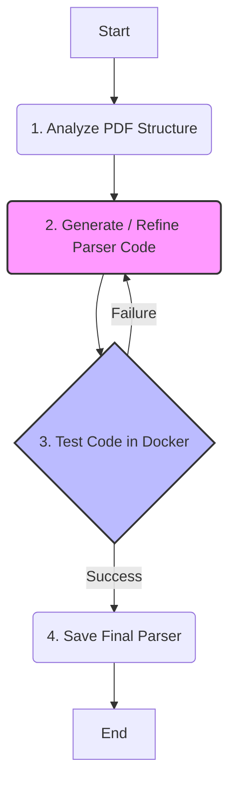

# Agent-as-Coder: Bank Statement Parser Generator
This project implemets an autonomous AI agent that automatically writes, tests, and self-corrects Python parsers for PDF bank Statements. The agent uses Google's Gemini 2.5 Pro model, LangGraph for state management, and Docker for safe code execution, creating a robust and extesible system for handling various bank statement formats without manual coding.

## Core Features
* Autonomous Parser Generation
* Self-Correction Loop
* Self Code Execution
* Adaptable

## Agent Architecture


1. Analyze PDF: The agent first examines the PDF's structure and text content to understand its layout.
2. Generate & Test: It writes a Python parser function and immeddiately calls the testing tool, which runs the code in a Docker container and compares its output DataFrame with a ground-truth CSV.
3. Refine: If the test fails, the detailed difference report is fed back to the agent. The agent analyzes the error (e.g., wrong column names, incorrect data types, bad parsing logic) and generates a new, improved version of the code, looping back to the testing step.
4. Save & End: Once the test passes, the agent calls the final tool to save the validated parser code to the `custom_parsers/` directory, completing its mission. The agent will then terminate its run.

# Getting Started
Follow these 5 steps to set up and run the agent on your local machine.

## Prerequisites
* Python 3.11+
* Docker installed and running.

## 1. Clone the Repository
```bash
git clone https://github.com/Rohan199/ai-agent-challenge.git
cd ai-agent-challenge
```

## 2. Set Up the Environment
Create and activate a Python virtual environment:
```bash
python -m venv .venv
source .venv/bin/activate
# On Windows, use: .venv\Scripts\activate
```
Install the required dependencies:
```bash
pip install -r requirements.txt
```

## 3. Configure your API Key
Create a `.env` file for your API key:
```bash
touch .env
```
Open the `.env` file and add your Gemini API key:
```bash
GOOGLE_API_KEY="your_api_key_here"
```

## 4. Build the Docker Image
The eagent uses a Docker image to safely test the generated code. 
```bash
docker build -t parser-agent .
```

## 5. Run the Agent
You can now run the agent. To generate the parser for the given ICICI bankstatment sample, run:
```bash
python agent.py --target icici
```

# How to Add a New Bank (e.g., SBI)
The agent is designed to be easily extensible. To make it generate a parser for a new bank:
1. Create a new directory under `data/`, for example, `data/sbi/`.
2. Add two new files to this new directory:
    * `sbi sample.pdf`: A sample PDF statement from the new bank.
    * `result.csv`: A corresponding CSV file containing the exactt traansaction data you expect the parser to extract. This servers as the ground-truth for testing.
3. Run the agen, pointing to the new target:
```bash
python agent.py --target sbi
``` 
