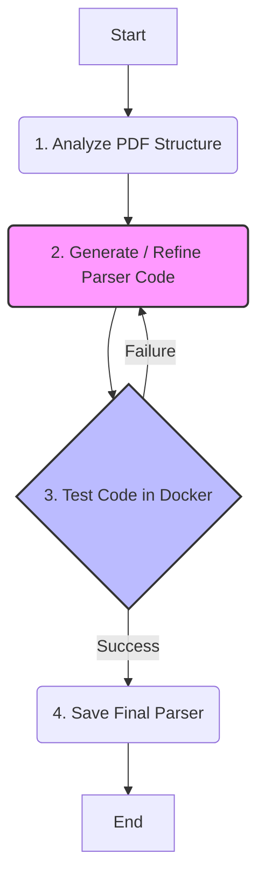

# Agent-as-Coder: Bank Statement Parser Generator
This project implemets an autonomous AI agent that automatically writes, tests, and self-corrects Python parsers for PDF bank Statements. The agent uses Google's Gemini 2.5 Pro model, LangGraph for state management, and Docker for safe code execution, creating a robust and extesible system for handling various bank statement formats without manual coding.

## Core Features
* Autonomous Parser Generation
* Self-Correction Loop
* Self Code Execution
* Adaptable

## Agent Architecture

