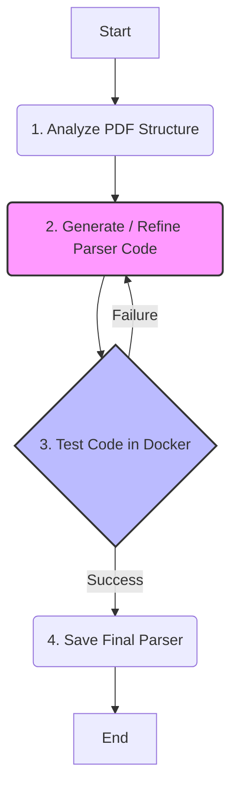

# Agent-as-Coder: Bank Statement Parser Generator
This project implemets an autonomous AI agent that automatically writes, tests, and self-corrects Python parsers for PDF bank Statements. The agent uses Google's Gemini 2.5 Pro model, LangGraph for state management, and Docker for safe code execution, creating a robust and extesible system for handling various bank statement formats without manual coding.

## Core Features
* Autonomous Parser Generation
* Self-Correction Loop
* Self Code Execution
* Adaptable

## Agent Architecture

1. Analyze PDF: The agent first examines the PDF's structure and text content to understand its layout.
2. Generate & Test: It writes a Python parser function and immeddiately calls the testing tool, which runs the code in a Docker container and compares its output DataFrame with a ground-truth CSV.
3. Refine: If the test fails, the detailed difference report is fed back to the agent. The agent analyzes the error (e.g., wrong column names, incorrect data types, bad parsing logic) and generates a new, improved version of the code, looping back to the testing step.
4. Save & End: Once the test passes, the agent calls the final tool to save the validated parser code to the `custom_parsers/` dirrectory, completing its mission.
